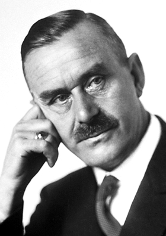

```{r setup, include=FALSE}
knitr::opts_chunk$set(echo = TRUE)
```

$~$


### My name is __*Thomas Mann*__

$~$




$~$

### I'm from Lübeck, Germany

$~$

### I'm interested in **fishing** so I bought a cottage built in the fishing village of Nidden.

$~$


### I'm a permanent home based novelist.

$~$


### I studied science at a Lübeck Gymnasium (secondary school), then attended the Ludwig Maximillians University of Munich as well as the Technical University of Munich, where, in preparation for a journalism career, I studied history, economics, art history and literature. Later on I went on to study Data Science at SMU.


$~$


## **“The other tabs represent work / analyses that I have completed.  Please check them out!”**

